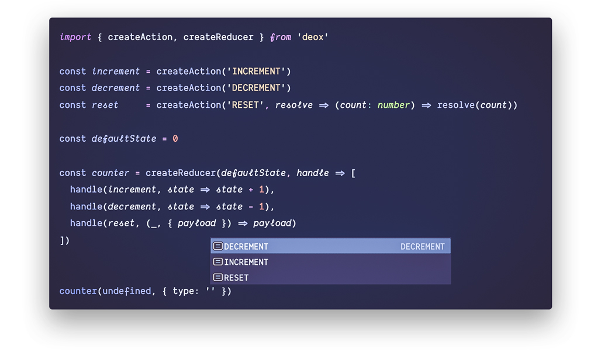

<h1 align="center">Deox</h1>

<h3 align="center">Functional type-safe Flux standard utilities</h3>

<p align="center">
  <a href="LICENSE">
    
  </a>
  <a href="https://circleci.com/gh/thebrodmann/deox">
    
  </a>
  <a href="https://codecov.io/gh/thebrodmann/deox">
    
  </a>
  <a href="https://greenkeeper.io/">
    
  </a>
  <a href="https://github.com/semantic-release/semantic-release">
    
  </a>
  <a href="https://www.npmjs.com/package/deox">
    
  </a>
  <a href="CONTRIBUTING.md">
    
  </a>
</p>

The only completely functional **type-safe** approach to Flux that its main goals are to diminish types **verbosity**, **repetition** and **complexity** without losing any type information (type-safe alternative of [redux-actions](https://github.com/redux-utilities/redux-actions)).

Behold, the art of Deox:

<p align="center">
  
</p>

## Highlights

- **Minimalist** (almost no import cost) - checkout [Bundle Phobia](https://bundlephobia.com/result?p=deox@latest).
- **Simple** - focused on self-declarative API.
- **Secure** - complete test-suits for all of the edge and corners.
- **Actively maintained** - monitoring issues and respond in a timely manner.

## Motivation

The most common complaint about Flux is how it makes you write a lot of boilerplate.
Also, existing solutions like redux-actions or redux-starter-kit are not type-safe by the idea (although there are some other ideas with classes 😱).

So, this is where Deox takes place to **make maintenance of Flux architecture simpler and more readable** by sticking to **functional programming paradigm**.

## Installation

You can install Deox package by running:

```bash
# YARN
yarn add deox

# NPM
npm install deox
```

> **Typescript tip**: notice that Deox internally uses some ES2015 type definitions to represent better developer experience.
> So if you are using [`Typescript`](https://github.com/Microsoft/TypeScript) and targeting `es5`, be sure `es2015` lib has been added in tsconfig.json:

```json
{
  "compilerOptions": {
    ...
    "target": "es5",
    "lib": ["es2015"]
  }
}
```

The Deox NPM package contains a [CommonJS](http://www.commonjs.org/specs/modules/1.0/) build that can be use with [Node.js](https://nodejs.org/en/) or module bundlers (e.g. [Rollup](https://github.com/rollup/rollup), [Webpack](https://github.com/webpack/webpack), etc.). it also includes an [ESM](https://developer.mozilla.org/en-US/docs/Web/JavaScript/Reference/Statements/import) build that works well with [tree-shaking](https://webpack.js.org/guides/tree-shaking/).

If you don't use module bundler, it's also fine. The Deox NPM package also includes a production minified [UMD](https://github.com/umdjs/umd) build that makes Deox available as global variable called `window.Deox`; you can add it simply to your page via following script tag:

```html
<script src="https://unpkg.com/deox@latest"></script>
```

## Usage

```ts
import { createActionCreator, createReducer } from 'deox'

const increment = createActionCreator('INCREMENT')
const decrement = createActionCreator('DECREMENT')
const reset = createActionCreator('RESET', resolve => (count: number) =>
  resolve(count)
)

const defaultState = 0

const counterReducer = createReducer(defaultState, handleAction => [
  handleAction(increment, state => state + 1),
  handleAction(decrement, state => state - 1),
  handleAction(reset, (_state, { payload }) => payload),
])

counterReducer(undefined, increment()) //=> 1
counterReducer(undefined, decrement()) //=> -1
counterReducer(3, reset(0)) //=> 0
```

## Documentation

- [Introduction](https://deox.js.org)
- [Getting started](https://deox.js.org/getting-started)
- [API reference](https://deox.js.org/api-reference)
- [FAQ](https://deox.js.org/api-reference)
  - [Using redux-thunk with Deox](https://deox.js.org/faq#using-redux-thunk-with-deox)
  - [Using redux-saga with Deox](https://deox.js.org/faq#using-redux-saga-with-deox)
  - [Using redux-observable with Deox](https://deox.js.org/faq#using-redux-observable-with-deox)

## FAQ

### Why not `redux-actions`, `redux-starter-kit` ?

Both `redux-actions` and `redux-starter-kit` are neat and almost similar to each other.
Actually `deox` is similar to those projects in the idea, but not in implementation and promise.
The main goal of `deox` is to use the full power of **type-safety** and **type inferring** in typescript.
If you have some experience with those libraries, the following piece of code should be familiar for you:

```ts
type Actions
  = ReturnType<typeof addTodo>
  | ReturnType<typeof removeTodo>
  | ReturnType<typeof editTodo>

const todosReducer = createReducer<State, Actions>(...)
```

This is horrible; Why define a type like actions that a reducer can handle?! It's completely obvious which actions a reducer handles.

On another hand there is a big problem with the pattern that `redux-actions` and `redux-starter-kit` follows. it's lack of correct type for action handler:

```ts
const todosReducer = createReducer<State, Actions>(defaultState, {
  [addTodo]: (state, action) => {...}, // action: Actions
  [removeTodo]: (state, action) => {...}, // action: Actions
  [editTodo]: (state, action) => {...}, // action: Actions
})
```

Type of action parameter in `addTodo` action handler is overall `Actions` type. It's inaccurate!

And this is where Deox comes in action and practice:

```ts
const todosReducer = createReducer(defaultState, handleAction => [
  handleAction(addTodo, (state, action) => {...}), // action: AddTodoAction
  handleAction(removeTodo, (state, action) => {...}), // action: RemoveTodoAction
  handleAction(editTodo, (state, action) => {...}) // action: EditTodoAction
])
```

That's it. Thanks to typescript type inferring **there is no type verbosity** at all. You can be sure `todos` reducer have the proper type of state and actions that it can handle.
And every action handler's type is just what it should be. It's completely safe and correct!

### What's the difference with `typesafe-actions` ?

The `typesafe-actions` is a great project that Deox carries huge inspiration from that.
But `typesafe-actions` doesn't have any plan for a complete set of utilities (specially reducers); **It's all about actions and action creators**.

## Versioning

Deox uses [Semantic Versioning 2.0.0](https://semver.org/)

## Contributing

Please read through our [contributing guidelines](CONTRIBUTING.md).

## Inspiration

- [redux-actions](https://github.com/redux-utilities/redux-actions) - Flux Standard Action utilities for Redux
- [typesafe-actions](https://github.com/piotrwitek/typesafe-actions) - Typesafe Action Creators for Redux / Flux Architectures (in TypeScript)

## License

Deox is released under [MIT license](LICENSE).
